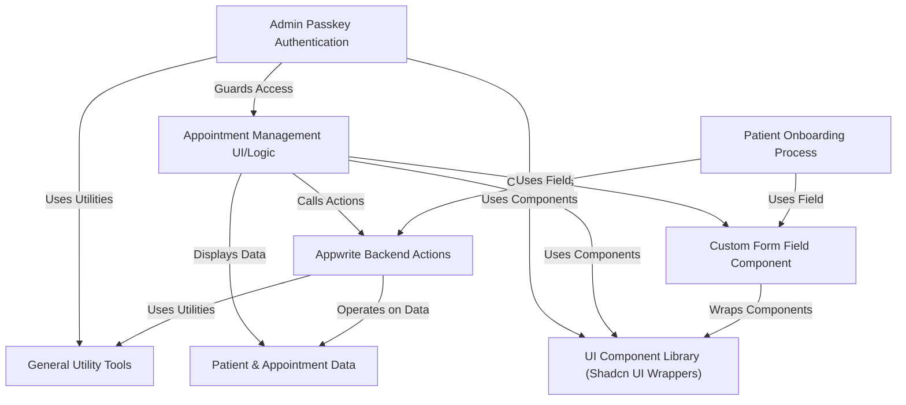

# Tutorial: careplus

Careplus is a platform designed to **manage patient appointments**.
It provides a user-friendly **onboarding process** for new patients to register their details
and facilitates **appointment scheduling**. Administrators can access a dashboard
requiring **passkey authentication** to view, manage, and update appointments through a dedicated interface.


## Visual Overview



## Chapters

1. [General Utility Tools
](01_general_utility_tools_.md)
2. [UI Component Library (Shadcn UI Wrappers)
](02_ui_component_library__shadcn_ui_wrappers__.md)
3. [Custom Form Field Component
](03_custom_form_field_component_.md)
4. [Patient & Appointment Data
](04_patient___appointment_data_.md)
5. [Appwrite Backend Actions
](05_appwrite_backend_actions_.md)
6. [Patient Onboarding Process
](06_patient_onboarding_process_.md)
7. [Admin Passkey Authentication
](07_admin_passkey_authentication_.md)
8. [Appointment Management UI/Logic
](08_appointment_management_ui_logic_.md)

---

<sub><sup>Generated by [AI Codebase Knowledge Builder](https://github.com/The-Pocket/Tutorial-Codebase-Knowledge).</sup></sub>

# Chapter 1: General Utility Tools

Welcome to the `careplus` project tutorial! In this first chapter, we'll start by looking at a fundamental piece of code that helps us keep things tidy and avoid repeating ourselves.

Imagine you're building something complex, like a house. You'll need basic tools like screwdrivers, hammers, and measuring tapes. These tools aren't just for one specific part of the house; you'll use them everywhere – framing walls, installing windows, putting together furniture.

In software projects like `careplus`, we often have tasks that come up again and again, no matter what specific feature we're working on. Things like:
*   Making a date look pretty ("Oct 25, 2023").
*   Turning a file the user picked into something the computer can easily show.
*   Changing simple text into a slightly less readable format (and back).

If we wrote the code for these common tasks every single time we needed them, our code would get long, messy, and hard to manage. It would be like buying a new screwdriver every time you need to tighten a screw!

This is where "General Utility Tools" come in. Think of it as our project's basic toolbox. It's a file where we collect these handy functions that can be used anywhere in the `careplus` application. This helps us write cleaner code and ensures we do common tasks the same way every time.

In the `careplus` project, our main utility toolbox file is located at `lib/utils.ts`. Let's open it up and see what tools are inside.

### Our Digital Toolbox: `lib/utils.ts`

The `lib/utils.ts` file contains several functions, each designed to do one specific, common job. Let's look at some of the key ones:

#### Combining Styles with `cn`

In modern web development, we often use libraries to help style our components. `careplus` uses **Tailwind CSS**, which involves adding special "class names" to elements to control their look. Sometimes, you need to combine multiple class names, or even combine them conditionally (like `text-red-500` only if there's an error).

The `cn` function (short for "class names") helps us do this smartly. It takes a bunch of class names as input and gives back a single, clean string of class names, handling potential duplicates or conflicts.

```typescript
import { type ClassValue, clsx } from "clsx";
import { twMerge } from "tailwind-merge";

export function cn(...inputs: ClassValue[]) {
  return twMerge(clsx(inputs));
}
```

**What's happening here?**
*   It uses two libraries: `clsx` for easily combining class names (even based on conditions you might add later) and `twMerge` which is specifically good at merging Tailwind classes, making sure the final result is correct even if you have conflicting styles (like `p-4` and `p-6`).
*   You can call it like `cn('text-blue-500', 'font-bold')` and it will return `'text-blue-500 font-bold'`. If you added more complex logic, it would still give you the right string. This is super useful when building UI components, which we'll see in [Chapter 2: UI Component Library (Shadcn UI Wrappers)](02_ui_component_library__shadcn_ui_wrappers__.md).

#### Cleaning Up Data with `parseStringify`

When we get data from a server (like from our backend in [Chapter 5: Appwrite Backend Actions](05_appwrite_backend_actions_.md)), it might sometimes contain extra technical details or structures that aren't easy to work with directly in certain situations, especially when dealing with frameworks like Next.js.

The `parseStringify` function is a neat little trick in JavaScript to "clean" data by converting it to a standard JSON string format and then immediately parsing it back into a JavaScript object. This process often strips away non-standard or complex parts of the data, leaving you with a simple, plain object that's easier to handle.

```typescript
export const parseStringify = (value: any) => JSON.parse(JSON.stringify(value));
```

**What's happening here?**
*   `JSON.stringify(value)`: Takes the input `value` and turns it into a JSON string (just plain text).
*   `JSON.parse(...)`: Takes that JSON string and turns it back into a JavaScript object.
*   This two-step process helps standardize the data structure.

#### Turning a File into a Web Address: `convertFileToUrl`

Imagine a user uploads a profile picture. Before you save it permanently, you often want to show them a preview right away in the browser. How do you show a file that's still on the user's computer or just selected?

The `convertFileToUrl` function helps with this. It takes a `File` object (which you get when a user selects a file using a file input) and creates a temporary web address (a "blob URL") that the browser can use to display that file, like an image.

```typescript
export const convertFileToUrl = (file: File) => URL.createObjectURL(file);
```

**What's happening here?**
*   `URL.createObjectURL(file)`: This is a built-in browser function. It creates a special, temporary URL that points to the `File` object you give it. This URL is only valid for the current browser session and is tied to the document that created it.
*   You can then use this temporary URL in places where you'd normally put a web address, like the `src` attribute of an `` tag.

#### Making Dates Look Nice: `formatDateTime`

Displaying dates and times can be tricky because you might need different formats in different places. For example, you might need "Oct 25, 2023" in one spot, "Monday, 10/25/2023" in another, and just "8:30 AM" somewhere else.

The `formatDateTime` function takes a date and provides you with several commonly needed formats.

```typescript
export const formatDateTime = (dateString: Date | string) => {
  // ... (options defined for different formats) ...

  const formattedDateTime: string = new Date(dateString).toLocaleString(
    "en-US",
    dateTimeOptions
  );

  // ... (similar lines for dateDay, dateOnly, timeOnly) ...

  return {
    dateTime: formattedDateTime,
    dateDay: formattedDateDay,
    dateOnly: formattedDate,
    timeOnly: formattedTime,
  };
};
```

**What's happening here?**
*   It takes a date (either a JavaScript `Date` object or a string that JavaScript can understand as a date).
*   It uses the built-in `toLocaleString()` method of JavaScript `Date` objects, which is great for formatting dates and times according to specific settings (like language and desired format options).
*   It defines different sets of `options` (`dateTimeOptions`, `dateDayOptions`, etc.) to tell `toLocaleString` exactly how to format the output (e.g., show the month as short text, the day as a number, the year as 4 digits).
*   It calls `toLocaleString` multiple times with these different options to get various formatted strings.
*   Finally, it returns an object containing all these different formats, so you can pick the one you need.

**Example Usage:**

```typescript
const myDate = new Date('2023-10-25T08:30:00Z'); // A specific date and time
const formattedDates = formatDateTime(myDate);

console.log(formattedDates.dateTime); // Output: "Oct 25, 2023, 8:30 AM"
console.log(formattedDates.dateOnly); // Output: "Oct 25, 2023"
console.log(formattedDates.timeOnly); // Output: "8:30 AM"
```

This function ensures that whenever you display a date or time in `careplus`, it looks consistent and is formatted correctly.

#### Simple Text Encoding/Decoding: `encryptKey` and `decryptKey`

Sometimes you might have a simple piece of information, like a passkey for authentication (which we'll discuss in [Chapter 7: Admin Passkey Authentication](07_admin_passkey_authentication_.md)), that you don't want sitting around in plain, easily readable text, especially if it's stored temporarily or passed around in certain ways.

While not strong encryption (meaning it's not truly secure against a determined attacker), `careplus` uses basic encoding/decoding to *obfuscate* (make less clear) this passkey slightly. It uses a method called Base64.

```typescript
export function encryptKey(passkey: string) {
  return btoa(passkey);
}

export function decryptKey(passkey: string) {
  return atob(passkey);
}
```

**What's happening here?**
*   `btoa(passkey)`: This is a built-in browser function that encodes a string into a Base64 string. It's commonly used to transmit binary data in a text format, but here it's used to change the original text `passkey` into a different sequence of characters.
*   `atob(passkey)`: This is the reverse function. It takes a Base64 string and decodes it back to the original string.
*   If you encode `"mysecretpasskey"`, you might get something like `"bXlzZWNyZXRwYXNza2V5"`. It doesn't look like the original text, making it slightly harder for someone casually looking at data to understand. However, anyone who knows it's Base64 can easily decode it. So, remember, this is **obfuscation**, not true **encryption**.

### Conclusion

In this chapter, we've explored the `lib/utils.ts` file, our project's basic toolbox. We learned about functions that help us manage CSS class names (`cn`), clean up data (`parseStringify`), turn files into temporary web addresses (`convertFileToUrl`), format dates and times in various ways (`formatDateTime`), and perform simple text encoding/decoding (`encryptKey`/`decryptKey`).

Using these utility functions keeps our code modular, readable, and consistent across the entire `careplus` application. Instead of writing the same date formatting logic everywhere, we use the standard `formatDateTime` function.

Now that we have a grasp of these general helper tools, we're ready to move on to how `careplus` builds its user interface using a library of reusable components.

[Next Chapter: UI Component Library (Shadcn UI Wrappers)](02_ui_component_library__shadcn_ui_wrappers__.md)

---

<sub><sup>Generated by [AI Codebase Knowledge Builder](https://github.com/The-Pocket/Tutorial-Codebase-Knowledge).</sup></sub> <sub><sup>**References**: [[1]](https://github.com/Abinash-sahoo7/careplus/blob/f60313f782de2fceef0f1545255900c86d2465a2/lib/utils.ts)</sup></sub>
